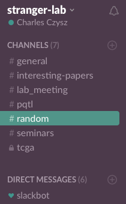
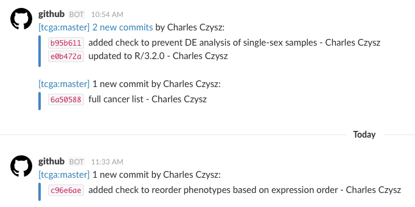

# Slack

Internet Relay Chat (IRC) meets Silicon Valley startup culture.

## Channels

Channels are where you will spend the bulk of your time using Slack. Each channel represents a specific theme/topic where invited members can post.



Currently, the lab Slack has channels for general announcements, links to papers, lab meeting discussion, posts on interesting seminars, and some project-specific channels.

Anyone in the lab can join any channel as well as set up their own channel, either public or private.


## Private Channels

I have created a channel for one of my projects and restricted it to allow only those I invite to see it. Currently it's printing a message whenever I commit to the project's Github repository.



# Git versus Github

Git is a versioning software, similar to SVN, Mercurial, and others. It can be used locally, storing changes in a .git directory. It can also be used to store repositories online, such as on Github or Bitbucket.

Fun fact: Adding your UChicago email address to your Github account *should* upgrade your account for free.

# Web Resources

[Git homepage](http://www.git-scm.com)

[Git Basics](https://git-scm.com/book/en/v2/Git-Basics-Getting-a-Git-Repository)

[Git - The Simple Guide](https://rogerdudler.github.io/git-guide/)

# Using git on Tarbell

Git should already be installed for you on tarbell. Confirm this by typing `git`.

This command is a quick way to see all available subcommands.

The most important commands for individual use are:

* `git add`
* `git commit`
* `git push`

For collaboration, you'll be adding

* `git checkout`
* `git fetch`
* `git merge`


Generally, you'll only want to track scripts and small text files. You can accomplish this by setting aside a directory only for scripts, or by ignoring files and directories with a `.gitignore` file, or both.

    .gitignore

    *.py
    #Ignore python files
    *.pdf
    # Ignore pdf files
    data/
    # Ignore the directory ./data


# Init

Before using git, there are a few defaults you'll want to set.

`git config --global user.name "<name>"`

`git config --global user.email "<email>"`

`git config --global core.editor <editor>` sets the preferred editor

## Existing directory
To set up a repository locally, `cd` to the directory and run

`git init`

to initialize a repo.

## Cloning a repository

To download an existing repository

`git clone <url>`

# Adding to a repo

The `git add <files>` command tracks the specified files and stages them for committing.

If you just initialized an existing directory, `git add .` will track all existing files and directories.

Once you've added the files you want to track, it's time to commit.

`git commit` will open your specified text editor to add a commit message.

You can also use `git commit -m "commit message"` to add the message directly.

Committing records changes to the local git repository. If you're working on a hosted repo, the `git push` command will send recent commits to the remote repo.

## Example Workflow

    echo "new line" >> file.txt
    git add file.txt
    git commit -m "added a new line"
    git push

# Ch-ch-ch-changes

Sometimes, you change many files before you commit them. To see all modified files, use

`git status`

The default output will look similar to this

``` bash
$ git status
On branch master
Changes to be committed:
(use "git reset HEAD <file>..." to unstage)
new file:   README
modified:   CONTRIBUTING.md
```
`git status -s` gives a more compact overview, for this example

``` bash
$ git status -s
 M CONTRIBUTING.md
?? README
```
You can add both files to the same commit using `git add .` or commit each individually.

## Removing tracked files

Deleting tracked files using `rm` won't automatically remove them from being tracked by git.

Use `git rm <file>` in order to untrack files. This should work even if you've already deleted the file.

`git add -A` will add and remove currently untracked files in the working directory.

https://xkcd.com/1296/

http://betterexplained.com/articles/a-visual-guide-to-version-control/
